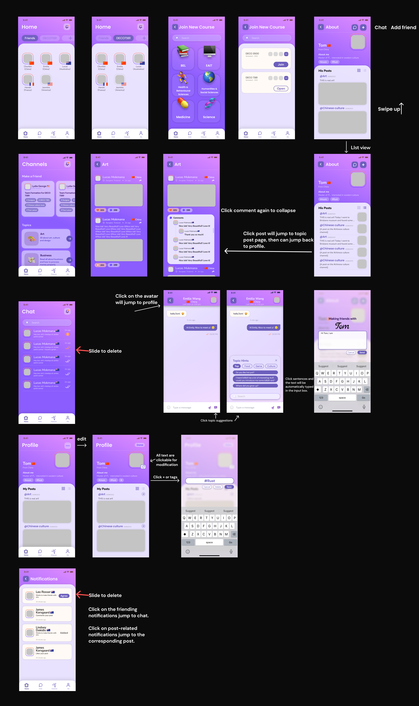
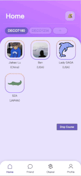

# WorldCitizen

International students often experience cultural loneliness due to isolation from familiar cultural settings and lack of cross-cultural relationships. Our app is designed to facilitate cultural exchange and ease this loneliness. The app enables online chatting between international and domestic students. Additional features like random friend recommendations and forums aim to increase the students' familiarity with different cultures and promote cross-cultural communication.

## Technologies selection

- Frontend: Vue
- Backend: Java, SpringBoot Framework
- Database: MySQL

## Preview (Expected)

*Ui Design*

## Outcome Demo

  

    

        
      
Home Page

    

    

         
      
Channel Page

    

    

        
      
Add tags and auto recommand

    

  

